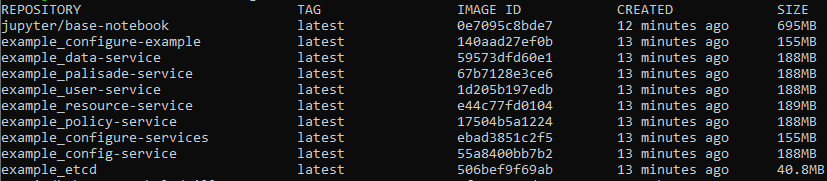
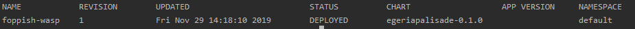

<!-- SPDX-License-Identifier: CC-BY-4.0 -->
<!-- Copyright Contributors to the ODPi Egeria and Palisade project. -->
<p align="center">
  
   
</p>

# Egeria Palisade integration

Egeria Palisade provides the Apache 2.0 licensed integration between Palisade and Egeria.  
We will cover how to start both services and run through a demo to collect metadata, and redact or mask information based on users context and purpose.  

### Prerequisites
1. [Git](https://git-scm.com/)
1. [Maven](https://maven.apache.org/)
1. [Docker](https://www.docker.com/)
1. [Kubernetes](https://kubernetes.io/)
1. [Helm](https://helm.sh/)
1. [Egeria](https://github.com/odpi/egeria)
1. [Palisade](https://github.com/gchq/Palisade)
1. [Egeria-Palisade](https://github.com/odpi/egeria-palisade)


<p>First things first we need to build Palisade and the Egeria-Palisade 
repository which requires a clone of the Palisade repository in the same folder as this repository.
To build the repositories, first:
</p>

```
./jars.sh 
```

<p>
This will change directory into the Palisade folder, and build all the artifacts, then change directory into the Egeria Palisade folder and build the artifacts and create the jars needed for the docker images.  
The next step is to create the images needed for helm, this is by compiling but not running the dockerfiles, and can be validated by running "docker images" after running, which will show a list of all the required docker images.
</p>

```
./images.sh 
```


Next, you can run deploy the images using helm to create pods containing each of the Palisade services.
```
./deploy.sh 
```
Which can be validated by running a `helm list` which returns something similar to the image included.


Next, run `kubectl get pods` to see all the kubernetes pods created by the helm install.

